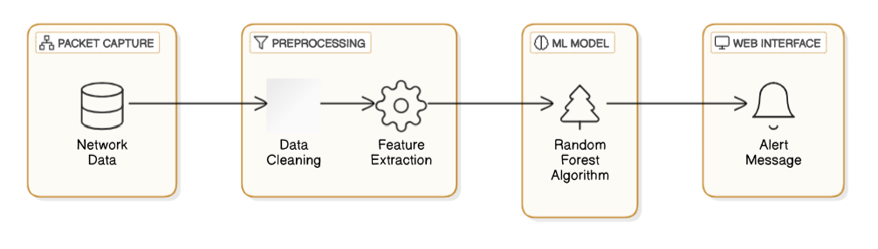

## Real-Time Network Intrusion Detection System Using Machine Learning

The Real-Time Network Intrusion Detection System (NIDS) is designed to monitor network traffic, detect malicious activities, and alert users in real time. The system utilizes Machine Learning (ML), specifically the Random Forest algorithm, to classify network packets as either normal or intrusive. It captures live network traffic, preprocesses the data, and identifies potential security threats based on predefined attack patterns.

The model detects Ping Attacks when 35 consecutive packets have the protocol "eth:ethertype:ip:data", and it flags Port Attacks when 150 consecutive packets use the protocol "eth:ethertype:ip:tcp". The results are displayed on a user-friendly web interface, providing real-time security insights. The system aims to enhance cybersecurity by reducing false positives, ensuring high detection accuracy, and improving overall network protection.

## About

The Real-Time Network Intrusion Detection System (NIDS) is a cybersecurity solution that monitors and analyzes network traffic to detect suspicious or malicious activities. This system leverages Machine Learning (ML), specifically the Random Forest algorithm, to classify network packets in real-time and identify potential cyber threats.

The project works by capturing live network traffic, preprocessing it, and then analyzing packet attributes such as source, destination, protocol, and length. It detects two specific types of attacks:

1. Ping Attack – Triggered when 35 consecutive packets use  the protocol "eth:ethertype:ip:data".

2. Port Attack – Triggered when 150 consecutive packets use the protocol "eth:ethertype:ip:tcp".

The system provides real-time alerts through a web interface, displaying messages such as "Intrusion Detected: Ping Attack" or "Intrusion Detected: Port Attack". The project aims to improve cybersecurity, reduce false positives, and enhance the efficiency of intrusion detection in home and enterprise networks.

## Features

1. Real-Time Packet Monitoring

    Captures and analyzes network traffic in real-time using packet sniffing tools like TShark.

2. Machine Learning-Based Detection

    Utilizes the Random Forest algorithm for high-accuracy intrusion detection.

    Learns from past network traffic data to improve threat identification.

3. Detection of Specific Attacks

    Ping Attack Detection – Alerts when 35 consecutive packets have the protocol "eth:ethertype:ip:data".

    Port Attack Detection – Alerts when 150 consecutive packets have the protocol "eth:ethertype:ip:tcp".

4. User-Friendly Web Interface

    Displays alerts and intrusion detection status dynamically.
    
    Allows users to upload network logs for analysis.

5. Automated Preprocessing

    Cleans and encodes categorical data (protocols, IP addresses, etc.) for ML model processing.
    
    Normalizes numerical data such as packet length for accurate detection.

6. High Accuracy & Low False Positives

    The Random Forest algorithm ensures robust classification of network packets.
    
    Reduces false alarms compared to traditional signature-based detection.

7. Customizable Detection Thresholds

    Users can modify the threshold values for different types of attacks.

8. Scalability & Adaptability

    Can be deployed in home networks, enterprise security systems, and cloud-based environments.
    
    Adaptable to detect new attack patterns with retrained models.

9. Logging & Reporting

    Maintains a log of detected intrusions for security auditing.

    Provides detailed insights into attack patterns.

## Requirements

1. Hardware Requirements:

    Processor: Intel Core i5 or higher (or equivalent AMD processor)

    RAM: Minimum 8GB (Recommended: 16GB for large datasets)

    Storage: Minimum 20GB free disk space

    Network Adapter: Ethernet/Wi-Fi Adapter for packet capturing

    Graphics Card: Not required, but a GPU (NVIDIA CUDA-enabled) can speed up training

2. Software Requirements:

    Operating System: Windows 10/11, Linux (Ubuntu, Kali Linux), or macOS

    Programming Language: Python 3.8 or higher

    Libraries & Dependencies:

        pandas – For handling and preprocessing network traffic data

        numpy – For numerical operations

        scikit-learn – For implementing the Random Forest algorithm

        flask – For building the web interface

        tshark (Wireshark CLI) – For real-time packet capturing

        matplotlib – For visualizing intrusion detection trends

        pickle – For saving and loading the trained machine learning model

3. Tools & Platforms:

    Jupyter Notebook / VS Code / PyCharm – For code development

    Postman – For API testing

    Wireshark/TShark – For network packet analysis
    MySQL / SQLite (Optional) – For logging detected intrusions

4. Network Requirements:

    Stable Internet Connection – For cloud-based deployment & updates

    Firewall & Security Tools – For testing system resilience

5. Dataset Requirements:

    KDD Cup 99, NSL-KDD, or real-time packet captures for model training

    CSV format logs from Wireshark, TShark, or other packet analyzers

## System Architecture

The system architecture of the fig 5.1 clearly shows that the input is given then using the machine learning model the intrusion is detected and classified based on the protocol .After the detection of the intrusion the alert message is displayed in the web interface.

## Output
## Home Page

## Detection Page

## Result

This project aims to develop a “Machine Learning-based Network Intrusion Detection System (NIDS)” to enhance network security through real-time detection. By using machine learning algorithms and feature extraction, the system will accurately identify malicious activities and minimize false positives. A web-based dashboard will enable real-time monitoring and alerts. The system is scalable, adaptable to new threats, and provides proactive defense, improving network security and setting the stage for future advancements.

## References

1.Kumar, R., et al. (2020). "A Survey of Intrusion Detection Systems in Network Security." International Journal of Computer Science and Network Security.

2.Singh, P., et al. (2021). "Application of Machine Learning Algorithms in Network Intrusion Detection: A Survey." Journal of Network and Computer Applications. 

